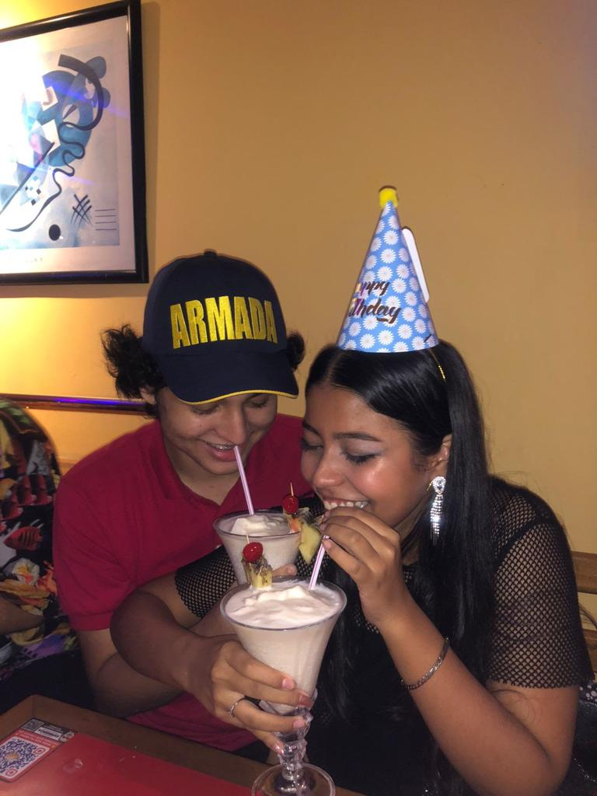

<!doctype html>
<html lang="en">

<head>
  <meta charset="utf-8">
  <meta name="viewport" content="width=device-width, initial-scale=1">
  <meta name="description" content="">
  <meta name="author" content="Mark Otto, Jacob Thornton, and Bootstrap contributors">
  <meta name="generator" content="Hugo 0.104.2">
  <title>Maren's Album</title>
  <link rel="canonical" href="https://getbootstrap.com/docs/5.2/examples/album/">

  <link href="../assets/dist/css/bootstrap.min.css" rel="stylesheet">

  

</head>

<body>

  <header>
    

      

        

          

            <h4 class="text-white">About</h4>
            
this is a compilation of beautiful moments that have had the fortune to be immortalized in photos and now shared on a web page..

          

          

            <h4 class="text-white">Contact</h4>
            <ul class="list-unstyled">
              <li><a href="https://www.instagram.com/marmejia.14/" class="text-white">Follow on instagram</a></li>
              <li><a href="https://www.facebook.com/mar.mejpar" class="text-white">Like on Facebook</a></li>
              <li><a href="mailto:maren.mejia@gmail.com" class="text-white">Email me</a></li>
            </ul>
          

        

      

    

    

      

        <a href="#" class="navbar-brand d-flex align-items-center">
          <svg xmlns="http://www.w3.org/2000/svg" width="20" height="20" fill="none" stroke="currentColor" stroke-linecap="round" stroke-linejoin="round" stroke-width="2" aria-hidden="true" class="me-2" viewBox="0 0 24 24">
            <path d="M23 19a2 2 0 0 1-2 2H3a2 2 0 0 1-2-2V8a2 2 0 0 1 2-2h4l2-3h6l2 3h4a2 2 0 0 1 2 2z" />
            <circle cx="12" cy="13" r="4" />
          </svg>
          <strong>Album</strong>
        </a>
        <button class="navbar-toggler" type="button" data-bs-toggle="collapse" data-bs-target="#navbarHeader" aria-controls="navbarHeader" aria-expanded="false" aria-label="Toggle navigation">
          
        </button>
      

    

  </header>

  <main>

    <section class="py-5 text-center container">
      

        

          <h1 class="fw-light">Day Dreaming</h1>
          
This is a sneak peak of the best moments of my life, I wish they were the 90% of my daily life but they are the ones who make me believe that life can be pretty (by it’s own way)

        

      

    </section>

    

      

        

          

            

              

              

                
This cutie pie is almost 2 years old, where did the years go?

                

                  

                  

                

              

            

          

          

            

              
              

                
First time meeting my boyfriend’s family, I’m glad I looked really cute.

                

                  

                  

                

              

            

          

          

            

              
              

                
Sunny day at the beach, happy life.

                

                  

                  

                

              

            

          

          

            

              
              

                
Peace before the storm.

                

                  

                  

                

              

            

          

          

            

              
              

                
Pre-Prom night, I still miss my school friends...

                

                  

                  

                

              

            

          

          

            

              
              

                
Sweet 17, happy couple because of love and some piñas coladas.

                

                  

                  

                

              

            

          

          

            

              
              

                
Töm, comfort food makes me so happy and loved.

                

                  

                  

                

              

            

          

          

            

              
              

                
Things can be bigger that what you expect, never trust what you see online.

                

                  

                  

                

              

            

          

          

            

              
              

                
Curious picnic, I wish I were there but I only painted it.

                

                  

                  

                

              

            

          

        

      

    

  </main>

  <footer class="text-muted py-5">
    

      

        <a href="#">Back to top</a>
      

      
First Maren's Album wait for the next one, i promise is going to be better

    

  </footer>

  

</body>

</html>
